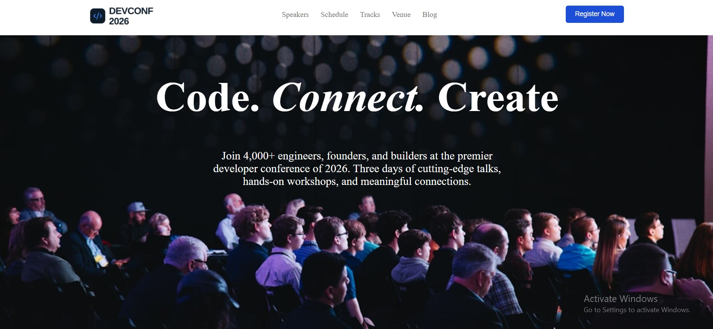

# Assignment 01 - B14

A clean and responsive web project built with **HTML5** and **CSS3**. This project focuses on creating a modern, user-friendly interface with a structured layout and responsive design.

## 🌐 Live Demo

**Live Website:**
https://miraj-dinajpur.github.io/Assignment-01-B14/

## 📸 Project Screenshot

<!-- Add your project screenshot here -->



## 🛠️ Technologies Used

* HTML5
* CSS3

## ✨ Main Features

* Responsive web design
* Clean and modern user interface
* Structured HTML5 layout
* Custom CSS styling
* Mobile-friendly layout
* Easy-to-use navigation and sections
* Cross-browser compatible design

## 📦 Dependencies

This project does not require any external package or framework.

### External Resources

* HTML5
* CSS3
* Google Fonts *(if used in the project)*
* External images/assets *(if used)*

## 🚀 How to Run Locally

Follow these steps to run the project on your local machine.

### 1. Clone the repository

```bash
git clone <your-github-repository-url>
```

### 2. Go to the project directory

```bash
cd Assignment-01-B14
```

### 3. Open the project

Simply open the `index.html` file in your browser.

Alternatively, you can use **VS Code Live Server** to run the project locally.

## 📁 Project Structure

```text
Assignment-01-B14/
│
├── index.html
├── style.css
├── assets/
│   └── ...
└── README.md
```

> The exact file structure may vary depending on the files included in the project.

## 🔗 Relevant Links

* **Live Demo:** https://miraj-dinajpur.github.io/Assignment-01-B14/
* **GitHub Repository:** Add your repository URL here

## 👨‍💻 Author

**Miraj**

Built with ❤️ using HTML5 and CSS3.
